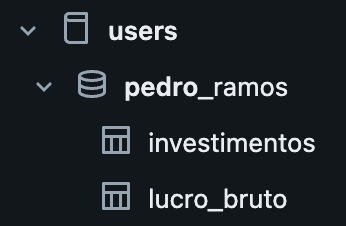
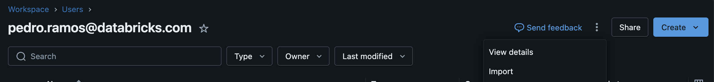
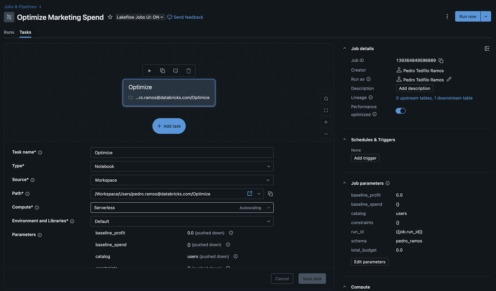
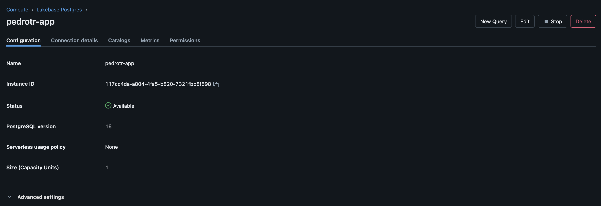

# Setup Inicial do Workshop

Acesse o workspace e faça o setup inicial dos recursos necessários para o app.

## 1. Ingestão dos dados

- Navegue até a seção do catálogo.
- Crie um catálogo e um schema que será usado exclusivamente por você ao longo da atividade.
- Navegue para ingestão de dados e crie tabelas a partir dos arquivos **investimentos.csv** e **lucro_bruto.csv** que podem ser encontrados no diretório *data*.
- Escolha o catálogo e o schema criados por você como o destino das tabelas.
- Não altere o nome da tabela, dos campos e nem o tipo das colunas.
- No final do processo você deve consegui ver algo semelhante a isso no seu catálogo:

## 2. Criação do job que executará as simulações

- Navegue para a área de workspace e, dentro da sua área pessoal, importe o arquivo **job_notebook.py**.

- Vá para a seção de Jobs & Pipelines e crie um novo **Job**.
- Ele deve conter apenas 1 task que será o notebook importado no primeiro passo dessa seção.
- Crie também os *job parameters* esperados pelo notebook. São eles:
    
    - baseline_profit: 0.0
    - baseline_spend: {}
    - catalog: <nome do catálogo criado por você>
    - constraints: {}
    - run_id: {{job.run_id}}
    - schema: <nome do schema criado por você>
    - total_budget: 0.0

- No fim dessa etapa, você deve ver algo como isso:

## 3. Criação da base de dados Lakebase

- Navegue para a seção de Compute e clique na aba de Lakebase Postgres.
- Crie uma nova base de dados com apenas 1 Capacity Unit.
- Quando a instância terminar de subir você deve ser capaz de ver algo semelhante a isso:

