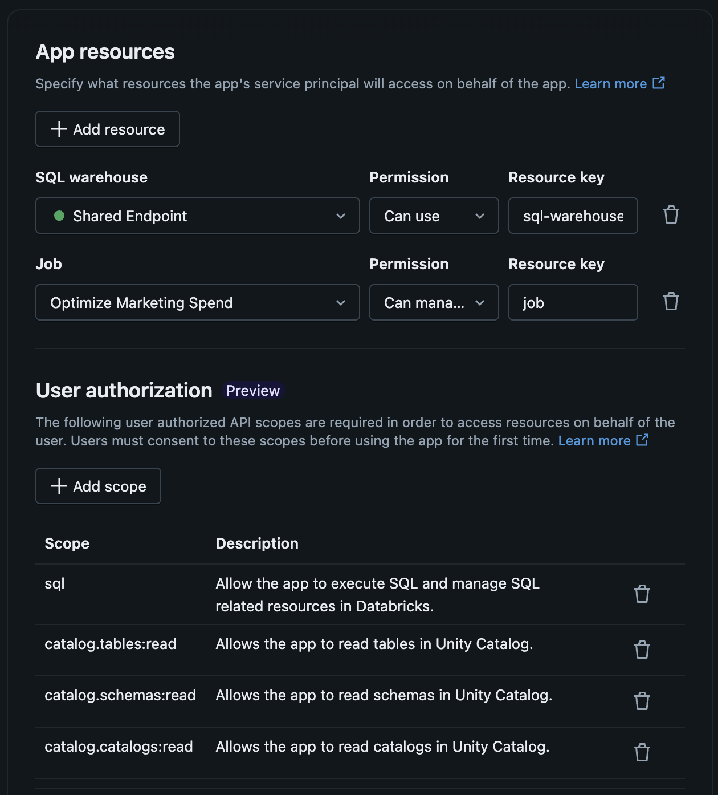
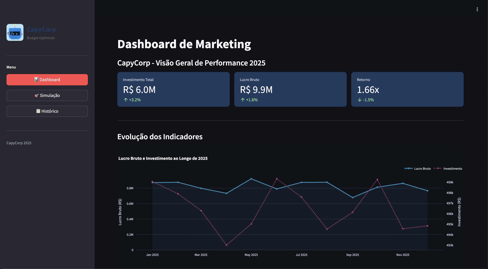

# Desafio 1 - Setup Inicial do App

## 1. Importe o código fonte do app

- Navegue para a seção de Workspace e, dentro da sua área pessoal, importe o arquivo **app_source_code.zip**. Ele deve criar um diretório com os arquivos necessários para o deploy do aplicativo via Databricks Apps.

## 2. Criação do app

- Navegue para a seção de Compute e clique na aba Apps.
- Crie um novo aplicativo e selecione a opção **Create a custom app**.
- Dê um nome para o seu aplicativo e avance para etapa clicando em **Next: Configure**
- Adicione 2 recursos:

    - 1 SQL Warehouse com permissão **Can use**. Não altere a chave do recurso.
    - 1 Job. Selecione o job que você criou no setup do workshop. Altere a permissão para **Can manage and run**, mas não altere a chave do recurso.

- Adicione também alguns scopes para autorização do usuário:

    - sql
    - catalog.catalogs:read
    - catalog.schemas:read
    - catalog.tables:read

- Verifique se o seu app possui os recursos que se parecem com os listados a seguir:

- Clique no botão para criar o app.

## 3. Primeiro deploy do app

- Aguarde a criação dos recursos necessários para o deploy do app e clique em **Deploy**.
- Selecione o diretório com o código fonte importado por você na etapa 1 e clique em Deploy, novamente.
- Acesse o app. A interface vai carregar, mas uma mensagem de erro vai aparecer.

## 4. Consertando o erro

- Use esse [link](https://learn.microsoft.com/pt-br/azure/databricks/dev-tools/databricks-apps/environment-variables) para solucionar parte do problema. Não foram configuradas todas as variáveis de ambiente necessárias.
- Além disso, navegue para o arquivo `data/dbsql.py` e com a ajuda desse [link](https://learn.microsoft.com/pt-br/azure/databricks/dev-tools/python-sql-connector#auth-pat), ajuste a parte faltante da integração com a sua SQL Warehouse.
- Faça um novo deploy e a tela inicial do app deve funcionar normalmente.
- Confirme que você consegue ver a tela abaixo:

