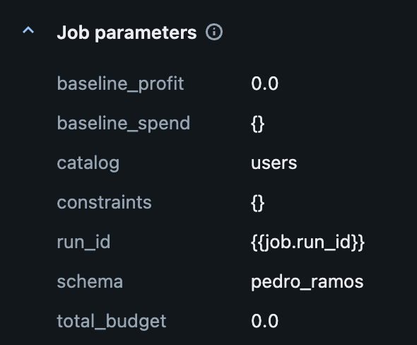
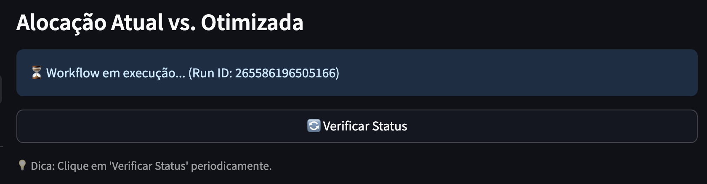

# Desafio 2 - Executando um Job

Navegue até o arquivo `data/workflows.py` para resolver esse desafio.

## 1. Configuração dos job parameters

- Preencha o dicionário **job_parameters** com os pares de chave e valor que representam os parâmetros que você definiu ao configurar o job via UI. Vale destacar que os valores que você havia definido via UI eram apenas valores default.

## 2. Integração com o job

- Consulte esse [link](https://apps-cookbook.dev/docs/streamlit/workflows/workflows_run) e implemente a chamada de função que dispara a execução do job.

## 3. Validando os ajustes

- Faça um novo deploy.
- Navegue para a seção de **Simulação** do app e clique em **Executar Otimização**.
- Se a integração tiver sido feita corretamente, você vai encontrar uma tela parecida com essa:

