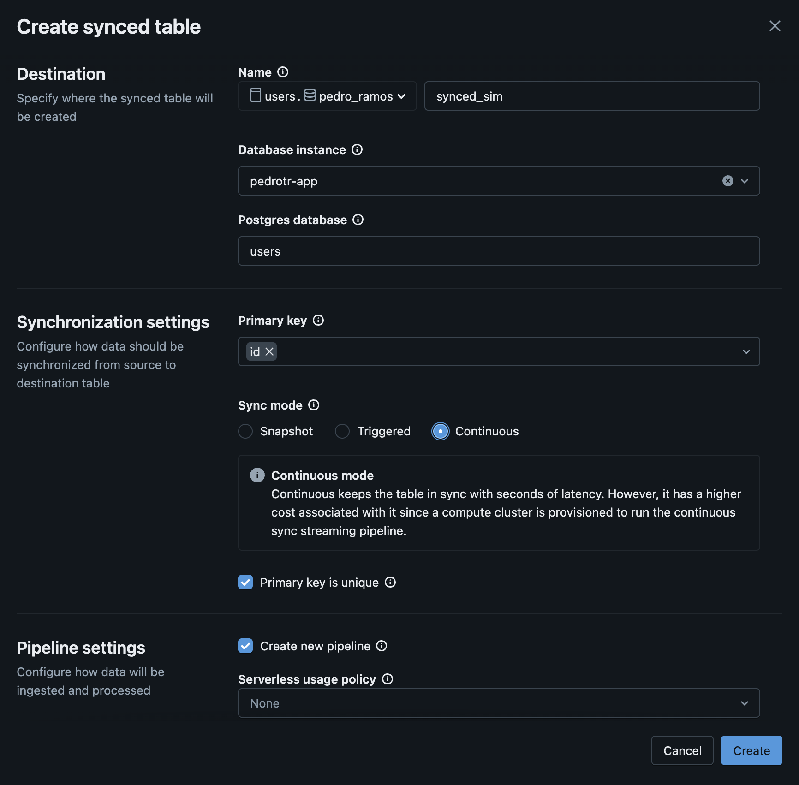
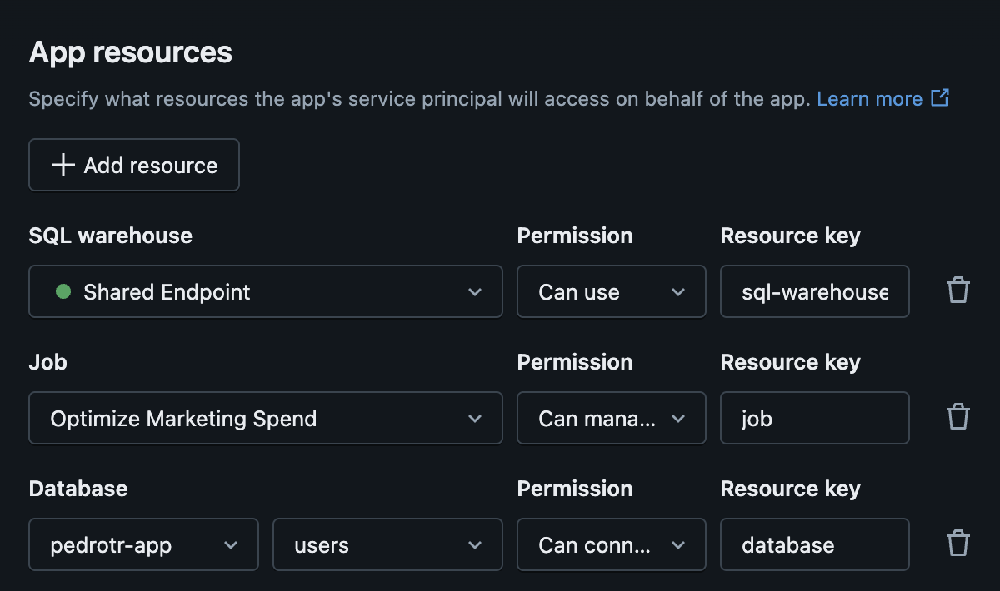

# Desafio 3 - Integrando uma base de dados transacional

Ao final da execução do Job, o aplicativo tenta puxar dados do Lakebase. Essa integração ainda não está implementada e precisamos finalizá-la. Por isso, vemos a mensagem de erro na tela.

## 1. Criando uma tabela sincronizada

- O job escreve os resultados em uma tabela Delta. Entretanto, a latência de leitura desses dados é ruim. Por conta disso, a ideia é que a gente use uma tabela sincronizada para fazer o ETL reverso sem necessidade de criar um código customizado.
- Navegue até o schema que você criou no início da atividade e selecione a tabela **resultados_simulacao**.
- Clique em **Create** e depois em **Synced table**.
- Preencha o formulário de criação da tabela.
    - O nome da tabela deve ser **synced_sim**.
    - Selecione a base de dados que você havia criado no Lakebase Postgres.
    - Altere o sync mode para **continuous**.
    - Não altere demais configurações.
- Suas configurações devem ficar assim:

## 2. Integrando o app com a sua tabela sincronizada

- Navegue até o aplicativo e edite suas configurações. Vamos adicionar mais um recurso.
- Inclua um recurso Database apontando para a instância Lakebase que você criou e para a base de dados usada pela sua tabela sincronizada. Dica: O nome da base de dados deve ser o nome do catálogo que você criou lá no início.

- Agora vá até o arquivo `data/lakebase.py` no código fonte do app e implemente a integração necessária. Use esse [link](https://apps-cookbook.dev/docs/streamlit/tables/lakebase_read) como referência.
- Caso tudo tenha sido implementado corretamente, você deve ser capaz de visualizar o histórico de simulações e executar uma nova simulação sem se preocupar com erro ao final da execução do job.